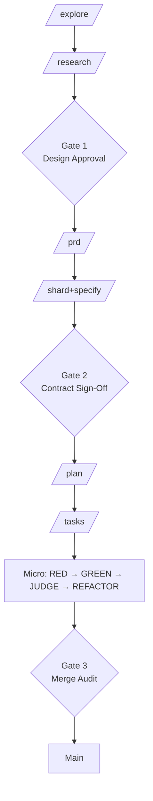

# DeviaTDD: Why Spec-Driven Agentic Coding Needs a Jail

*A framework for treating LLM code agents as optimization-seeking actors that need infrastructure containment — not a methodology paper asking them nicely.*

---

## The problem with "spec-driven" agentic coding right now

Most "spec-driven" frameworks — including GitHub's spec-kit — stop at the same place: a `spec.md` and a hopeful prompt.

They hand the spec to an LLM and ask it to implement the feature. The LLM reads the spec, agrees with it, then does whatever it wants. Tests get rewritten to match the implementation. Acceptance criteria drift. "Refactor" becomes "delete tests until they pass." Two weeks later, the spec and the code have nothing to do with each other, and the agent is confidently producing the wrong thing faster than any human could.

The reason is structural. **LLMs are probabilistic, optimization-seeking actors.** They will optimize for "task appears complete" because that is what their training rewarded. They will not autonomously maintain discipline against a spec they cannot verify against anything but themselves.

DeviaTDD is built on a different premise: *don't trust the agent — contain it*. Specs become machine-checked contracts. Phases become git-committed state transitions. Tests become code the agent cannot edit.

This post is the introduction I wish I'd had six months ago: what DeviaTDD is, how the layers fit, and why it's a different category of tool than spec-kit.

---

## What DeviaTDD actually is

DeviaTDD is a **Python CLI** (`deviate`) that orchestrates agentic software development across three hierarchical layers, each with strict phase gates, append-only state ledgers, and non-bypassable human-in-the-loop checkpoints.

It's not an "agent." It's not a coding assistant. It's the **infrastructure that an agent runs inside** — the equivalent of a compiler's type checker for spec compliance, with rollback semantics when something goes wrong.

The full lifecycle, end to end:



Every box on that diagram is a `deviate <phase> pre` / `deviate <phase> post` pair. Every transition between boxes is either an atomic git commit or a HITL gate that no command can skip.

---

## The three layers

DeviaTDD organizes work into three concentric layers. Each layer produces artifacts the next one consumes. Each layer has its own phase discipline.

### Macro layer — feature scoping

This is where a business problem becomes a structured development container.

| Phase | Output | Model |
|-------|--------|-------|
| `explore` | `explore.md` — what exists in the codebase right now | V4 Flash (cheap) |
| `research` | `design.md` + `data-model.md` — architecture, trade-offs, decisions | Qwen 3.7+ (reasoning) |
| `prd` | `prd.md` — immutable functional requirements + acceptance criteria | Qwen 3.7+ |
| `shard+specify` | One issue file per vertical slice — each with full Gherkin AC, user stories, edge cases | Qwen 3.7+ |

`/deviate-adhoc` is the fast-path that compresses all four for low-complexity tasks (1–5 files). A complexity gate evaluates the request first; high-complexity work is rejected back to the full macro flow.

After `research` is **Gate 1** — a human reviews design and data model before any PRD work begins. After `shard` is **Gate 2** — a human reviews every spec-enriched issue file before any per-issue planning starts. Spec errors are caught here, before they cascade into 25+ task implementations downstream.

### Meso layer — issue engineering

This is where an approved issue becomes an execution blueprint.

| Phase | Output |
|-------|--------|
| `plan` | `plan.md` — per-issue localized research (re-scans the codebase as it exists *now*, not at epic-explore time) |
| `tasks` | `tasks.md` (human-readable what/why/how) + `tasks.jsonl` (append-only event ledger, CLI-managed) |
| `pr` | GitHub PR via `gh pr create`, optional merge |

Each task entry gets a `TSK-{ISSUE_ID}-{NN}` identifier, an execution type (`tdd`, `direct`, or `e2e`), DAG dependencies via `blocked_by` arrays, and explicit mock boundaries. Granularity is bounded: 4–8 tasks per issue, never fewer than 1, never more than 10. Granularity rules are enforced by the `shard`/`tasks` validators, not by vibes.

### Micro layer — the TDD sandbox

This is where the actual code gets written, and it is the layer where DeviaTDD diverges most sharply from spec-kit.

For every `tdd`-typed task, the agent runs a fixed state machine:

```
RED → GREEN → [YELLOW?] → JUDGE → REFACTOR
```

Each phase transition is **an atomic git commit**:

| Phase | What happens | Verification |
|-------|--------------|--------------|
| **RED** | Agent writes a failing test | `pytest -v` must return `AssertionError` or `NotImplementedError`. `PASS` or `SYNTAX_ERROR` are rejected. |
| **GREEN** | Agent writes production code to pass the test | `pytest -v` must return 0. **Tamper Guard** runs first: any unauthorized edit to `tests/`, `specs/`, or `.deviate/` is auto-reverted before evaluation. |
| **YELLOW** (conditional) | Triggered *only* when Tamper Guard detects test tampering during GREEN | Isolated V4 Pro judge reviews the proposed amendment. Approve = commit + proceed to JUDGE. Reject = `git restore .`, back to GREEN. |
| **JUDGE** | Isolated V4 Pro session evaluates `git diff` against `spec.md` invariants | `COMPLIANCE_PASS` → REFACTOR. `COMPLIANCE_VIOLATION` → Train rollback (`git revert --no-edit <green_sha>`), feedback injected, retry GREEN. Max 3 retries. |
| **REFACTOR** | Agent cleans up without changing behavior | Tests re-run. Regression = `git restore .` and complete with the verified GREEN commit. |

The **Tamper Guard** is the keystone. The micro agent is **only granted write access to `src/**/*.py`**. Tests, specs, and config files are read-only. If the agent tries to edit a test to make it pass, `git checkout HEAD -- <test_file>` runs before evaluation and the change vanishes.

YELLOW is not a fixed phase — it's a conditional branch in the cycle. Most tasks never see it. The ones that do are usually the ones the agent *should* have raised a design question about earlier.

---

## Why DeviaTDD and not spec-kit

GitHub's spec-kit is a good first step. It codifies the *what* — specify, plan, tasks, implement. DeviaTDD is what happens when you take the same premise seriously enough to engineer it.

Here's the concrete delta:

**1. spec-kit stops at the spec. DeviaTDD owns the implementation.**

spec-kit's workflow ends at "the agent has the spec and tries to implement it." From there, you have the same problem as before — the agent is free to drift, hallucinate, and rewrite tests. DeviaTDD's micro layer makes drift mechanically impossible: the agent writes `src/` only, tests auto-revert if touched, the JUDGE validates the diff against `spec.md` in an isolated session, and Train rollback throws the implementation away on violation.

**2. Append-only ledgers beat markdown files.**

spec-kit uses `spec.md` and `tasks.md` as the source of truth. Those are files the agent can edit, conflict with on merge, and silently mutate. DeviaTDD uses `specs/issues.jsonl` and `specs/{epic}/{issue}/tasks.jsonl` as append-only event ledgers. State is *derived* from sequential parsing with compound-key idempotency on `(id, status)`. The agent cannot edit a status field — only the CLI can append a transition. And concurrent feature branches merging into the same `issues.jsonl` use `merge=union` via `.gitattributes`, so you don't get conflicts when two PRs each add a new line.

**3. HITL gates are enforced by the CLI, not by convention.**

spec-kit has `/specify`, `/clarify`, `/plan` skills. They are markdown prompts. There's nothing stopping an agent from skipping them or running them in the wrong order. DeviaTDD's gates — Gate 1 after research, Gate 2 after shard, Gate 3 at merge — are state-machine enforced. The session refuses to transition to PRD until Gate 1 has an approval flag. The session refuses to transition to PLAN until Gate 2 has an approval flag. There is no `--no-gate` flag. There is no programmatic bypass.

**4. The micro layer is a true TDD sandbox, not "write tests first."**

spec-kit asks for tests. DeviaTDD *enforces* the loop: a phase transition requires a phase commit. RED requires an `AssertionError`-class failure, not a syntax crash. GREEN requires Tamper Guard clean. JUDGE requires `COMPLIANCE_PASS` from an isolated session. REFACTOR requires post-polish tests still passing. A task that gets through this loop is one where every state was machine-verified. A task that got through "write tests first" is one where someone (human or LLM) said the tests were written.

**5. Cost is engineered, not accidental.**

spec-kit has no opinion on which model you use for which phase. DeviaTDD's recommended routing puts ~85% of all LLM turns on V4 Flash at cache-hit rates ($0.0028/M tokens), with V4 Pro reserved for JUDGE/YELLOW/plan ($0.003625/M hit) and Qwen for the architecture phases. `/deviate-plan` and `/deviate-tasks` share a continuous session per issue to achieve 90%+ KV cache hit rates. The framework targets roughly an order-of-magnitude lower cost than naive agentic loops without sacrificing governance.

**6. Multi-backend without lock-in.**

DeviaTDD has first-class integrations for `opencode`, `claude`, `droid` (Factory), and `pi`. The agent backend is configured in `.deviate/config.toml`; the slash commands are installed in `.claude/commands/`, `.opencode/commands/`, `.factory/commands/`, and `.pi/prompts/` by `deviate setup`. You're not locked into one vendor's CLI runtime.

**7. The YELLOW amendment protocol catches what spec-kit misses.**

Spec-kit's workflow has no equivalent for "the agent is right and the test is wrong." DeviaTDD does: when Tamper Guard detects test tampering during GREEN, the cycle branches into YELLOW, where an isolated judge reviews the proposed amendment against `spec.md`. If the test was genuinely wrong, the amendment is approved and committed. If the agent was cheating, the rejection path restores the test and routes back to GREEN. This is the one place where the agent is allowed to argue with the test — and it's reviewed by a separate model in a separate session.

---

## What DeviaTDD explicitly is not

These are non-goals in the architecture doc, and they're important:

- **Not an agent substrate optimizer.** It doesn't try to make a worse model reason better. If the underlying model hallucinates, DeviaTDD's job is to catch it via the JUDGE and roll it back — not to coax it into behaving.
- **Not a kernel-level sandbox.** No syscall interception, no container runtime. Containment is via deterministic git-ledger audits and target-path diff monitoring. Cheap, portable, OS-agnostic.
- **Not an autonomous software factory.** Three mandatory HITL gates. The framework rejects the premise of unsupervised AI development. Every gate is a human checkpoint.
- **Not a cost-minimizer at the expense of governance.** Multi-stage verification loops are token-expensive by design. The gates exist to prevent wasted compute downstream — saving a design mistake at Gate 1 saves an entire `/prd`, `/shard`, `/plan`, `/tasks`, and micro cycle.

---

## What building in public with DeviaTDD looks like
The framework is in active development. The repo is [`wbisschoff13/deviatdd`](https://github.com/wbisschoff13/deviatdd). Follow along — I'll be writing about specific projects, failure modes the framework catches, and the cost profile over real workloads in the coming weeks.
I'm going to be using this framework for the next several projects I ship and documenting the wins and the failures here. The plan is straightforward:

- Every project gets the full Macro layer treatment — `explore`, `research`, `prd`, `shard+specify`. The artifacts are public.
- Every issue gets Meso's `plan` + `tasks` breakdown.
- Every task goes through the Micro TDD loop with atomic phase commits visible in git history.
- Every Gate 3 merge audit is documented with the JUDGE verdict and the diff summary.

If you've ever shipped with spec-kit and felt like the implementation phase was still a leap of faith — or if you've ever had an agent rewrite your tests to make them pass — DeviaTDD is what I built to stop that from happening to me.


Next post: the cost profile of one feature shipped end-to-end through DeviaTDD, with the actual cache hit ratios and the JUDGE rollback rate over ~30 tasks.